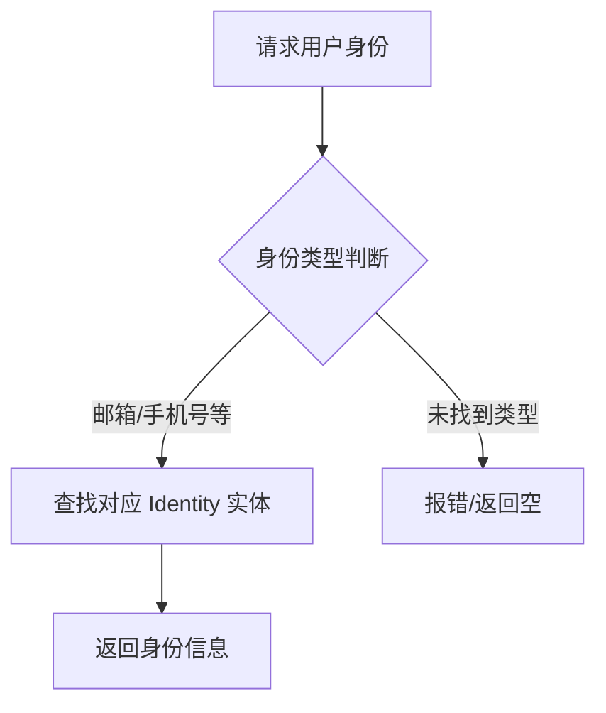

# UserID Bundle 工作流程（Mermaid）

```mermaid
flowchart TD
    A[请求用户身份] --> B{身份类型判断}
    B -- 邮箱/手机号等 --> C[查找对应 Identity 实体]
    C --> D[返回身份信息]
    B -- 未找到类型 --> E[报错/返回空]
```

## 说明

- 用户身份查找流程：根据传入的身份类型和身份值，查找对应的 Identity 实体，若存在则返回身份信息，否则报错或返回空。
- 支持扩展更多身份类型。
